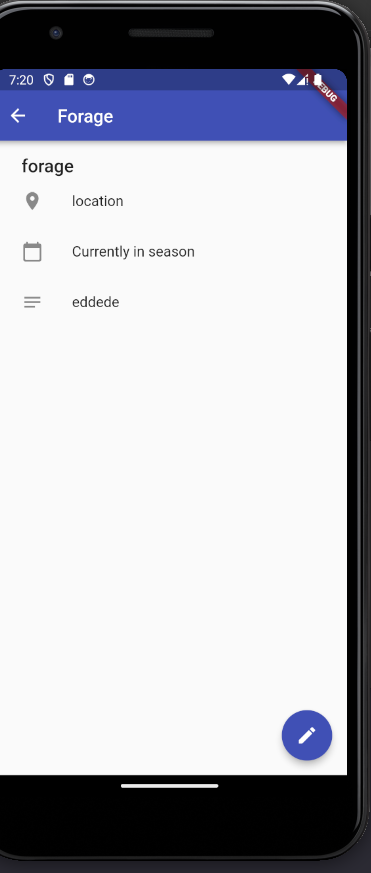

# App FOrage

* Uso de providers
* Cambio de pantallas

# Lo que me costo mas trabajo
* El uso de multiproviders, preferi este approach porque considero que
  cada provider debe tener su responsabilidad y no mezclarlos en un solo.

# Lo que aprendi
* El uso de multiproviders
* El uso de multiproviders con varias pantallas

# Screenshots

